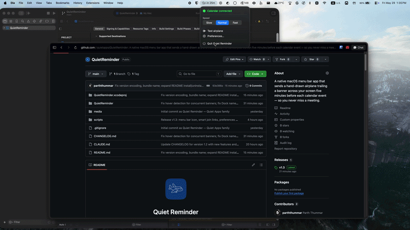

<div align="center">


# Quiet Reminder

**A hand-drawn airplane flies across your screen before every meeting.**

A native macOS menu bar app that sends a hand-drawn airplane trailing a banner across your screen five minutes before each calendar event — so you never miss a meeting. Part of the [Quiet Apps](https://github.com/quietapps) family.

[](https://www.apple.com/macos/)
[](https://swift.org)
[](https://developer.apple.com/xcode/swiftui/)
[](LICENSE)
[](https://github.com/quietapps/QuietReminder/releases)
[](https://github.com/quietapps/QuietReminder/releases)
[](https://github.com/quietapps/QuietReminder/stargazers)

[Install](#install) · [Features](#features) · [Usage](#usage) · [Build from source](#build-from-source) · [FAQ](#faq)

<p>
  
</p>

</div>

---

## Why

You're heads-down in code, a doc, a design — and the standup starts in three minutes. Quiet Reminder sends a hand-drawn airplane gliding across your screen, trailing a banner with the meeting title, five minutes before every event on your calendar. No notification badge to dismiss, no menu bar to check. You literally cannot miss it.

Works with any calendar you've connected to Calendar.app — iCloud, Google, Exchange, or all three at once.

## Features

- **Flying banner** — borderless transparent panel above every window, including fullscreen apps; banner shows meeting title and attendee names on two lines
- **Reads all your calendars** — EventKit reads directly from Calendar.app; any account (iCloud, Google, Exchange) connected there is automatically included
- **Per-calendar filter** — toggle individual calendars on or off in Preferences; changes take effect immediately, no restart needed
- **Configurable lead time** — add multiple alert thresholds (0, 1, 2, 3, 5, 10, 15, 20, 30, 45, 60 min); fire as many simultaneous flyovers as you like
- **Meeting end warning** — optional second flyover near the end of a meeting (1, 2, 3, 5, or 10 minutes before it ends)
- **Multi-screen** — choose All Screens, a specific named display, or **Active Screen** (whichever display your cursor is on when the alert fires)
- **Snooze** — click the airplane mid-flight to snooze; re-alerts after a configurable duration (2, 5, or 10 minutes); or set to "Off" to dismiss forever
- **Pause notifications** — suppress all flyovers for 5 / 10 / 15 / 30 minutes, 1 hour, the rest of today, or indefinitely; auto-resumes when the duration expires; pause icon shown in the menu bar while active
- **Skip solo events** — optionally suppress alerts for events with no other attendees (personal blocks, reminders)
- **Quiet hours** — configure a time window during which no alerts fire (e.g. 10 PM – 8 AM)
- **Meeting join links** — detects Teams, Zoom, Google Meet, Webex, and more; decodes Microsoft SafeLinks and Mimecast protection wrappers automatically; click the airplane or a "Join ↗" button to open the link
- **Calendar-color banner** — optionally tint the banner to match the event's calendar color so you can instantly identify which calendar triggered the alert; text color adjusts automatically for legibility
- **Airplane themes** — eight presets (Classic, Sky, Sunset, Rocket, UFO, Paper, Pigeon, Dragonfly); picker in Display tab shows live previews
- **Banner opacity** — slider (30–100%) to fade the banner without affecting the airplane
- **Configurable screen position** — slider controls the vertical position of the airplane strip (10%–90% from bottom)
- **Speed picker** — Slow / Normal / Fast flight duration
- **Custom alert sound** — choose from all 14 macOS system sounds (Basso, Blow, Bottle, Frog, Funk, Glass, Hero, Morse, Ping, Pop, Purr, Sosumi, Submarine, Tink); previews on selection
- **Upcoming events** — menu bar popover lists the next 3 events for today with calendar-color dots; toggleable
- **Menu bar countdown** — shows time to next meeting in the menu bar (e.g. `in 4m`); optionally appends the event title (e.g. `in 4m · Standup`)
- **Launch at login** — registers with `SMAppService`; toggle in Preferences
- **Test mode** — trigger the animation on demand from the menu bar
- **Menu bar agent** — no Dock icon, no app switcher entry

## Install

> **Note:** Quiet Reminder is not code-signed with an Apple Developer ID. macOS Gatekeeper will warn on first launch. The steps below work around it automatically.

### Homebrew (recommended)

```bash
brew tap quietapps/quietreminder
brew install --cask quietreminder
```

The cask strips the macOS quarantine attribute on install so Gatekeeper does not block launch. The tap is at [quietapps/homebrew-quietreminder](https://github.com/quietapps/homebrew-quietreminder).

### Direct download

1. Grab `QuietReminder-1.4.zip` from the [latest release](https://github.com/quietapps/QuietReminder/releases/latest)
2. Unzip → drag **Quiet Reminder.app** into `/Applications`
3. Strip the quarantine attribute (or right-click → Open once):

```bash
xattr -cr "/Applications/Quiet Reminder.app"
```

4. Launch Quiet Reminder — the ✈️ icon appears in your menu bar
5. Click ✈️ → **Grant Calendar access** and allow when prompted

### If the app doesn't open (Gatekeeper blocked it)

macOS silently blocks unsigned binaries on first launch. Fix it once with any of these:

**Option A — Right-click open (no Terminal needed)**
1. Open Finder → `/Applications`
2. Right-click **Quiet Reminder.app** → **Open**
3. Click **Open** in the warning dialog
4. macOS remembers your choice for every future launch

**Option B — Terminal**
```bash
xattr -cr "/Applications/Quiet Reminder.app"
```

**Option C — System Settings**
1. Try to launch the app — macOS shows a blocked notification
2. Open **System Settings → Privacy & Security**
3. Scroll down to the message about Quiet Reminder
4. Click **Open Anyway**

## Updating

### Homebrew

```bash
brew update
brew upgrade --cask quietreminder
```

### Direct download

Download the newer zip from [Releases](https://github.com/quietapps/QuietReminder/releases), drag the new **Quiet Reminder.app** over the old one in `/Applications`, then run:

```bash
xattr -cr "/Applications/Quiet Reminder.app"
```

## Uninstalling

### Homebrew

```bash
# Remove the app and its preferences (via the cask's zap stanza)
brew uninstall --cask --zap quietreminder

# Drop the tap
brew untap quietapps/quietreminder

# Purge Homebrew's download cache
brew cleanup --prune=all -s
```

Optional manual cleanup if you skipped `--zap`:

```bash
defaults delete app.quiet.QuietReminder 2>/dev/null
rm -rf ~/Library/Preferences/app.quiet.QuietReminder.plist \
       ~/Library/Application\ Support/Quiet\ Reminder \
       ~/Library/Caches/app.quiet.QuietReminder \
       ~/Library/HTTPStorages/app.quiet.QuietReminder \
       ~/Library/Saved\ Application\ State/app.quiet.QuietReminder.savedState
```

### Direct download

```bash
# Move the app to Trash
rm -rf "/Applications/Quiet Reminder.app"

# Remove saved settings + caches
defaults delete app.quiet.QuietReminder 2>/dev/null
rm -rf ~/Library/Preferences/app.quiet.QuietReminder.plist \
       ~/Library/Application\ Support/Quiet\ Reminder \
       ~/Library/Caches/app.quiet.QuietReminder \
       ~/Library/HTTPStorages/app.quiet.QuietReminder \
       ~/Library/Saved\ Application\ State/app.quiet.QuietReminder.savedState
```

## Usage

| Action | How |
|---|---|
| Grant calendar access | Click ✈️ → **Grant Calendar access** → Allow |
| Open Preferences | Click ✈️ → **Preferences…** |
| Change alert timing | Preferences → Alerts tab |
| Filter calendars | Preferences → Calendars tab |
| Change theme, position, or opacity | Preferences → Display tab |
| Change sound | Preferences → General tab → Alert sound |
| Snooze an alert | Click the airplane mid-flight |
| Join a meeting | Click the airplane (or hover → **Join ↗**) |
| Pause all notifications | Click ✈️ → **Pause notifications** → choose duration |
| Resume notifications | Click ✈️ → **Resume notifications** (or open popover → Resume) |
| Test the animation | Click ✈️ → **Test airplane** |
| Quit | Click ✈️ → **Quit** |

The airplane appears automatically before each upcoming event. No further interaction needed once Calendar access is granted.

## Permissions

Quiet Reminder needs **Calendar** access to read upcoming events.

On first launch click **Grant Calendar access** in the menu — macOS shows its standard privacy prompt. The app polls every 60 seconds and starts alerting as soon as access is granted, no restart required.

## Adding your Google Calendar

Quiet Reminder reads from Calendar.app via Apple's EventKit framework. No separate Google integration needed:

1. **System Settings → Internet Accounts → Add Account → Google**
2. Sign in and allow access; make sure **Calendars** is toggled on
3. Open **Calendar.app** and confirm your Google events appear
4. Click **Test airplane** in the Quiet Reminder menu to confirm

No API keys, no OAuth client setup, no developer console.

## Build from source

### Requirements

- macOS 26.0 or later
- Xcode 26.0 or later
- Calendar.app with at least one calendar configured

No paid Apple Developer account required — the project uses ad-hoc signing (`Sign to Run Locally`).

### Steps

```bash
git clone https://github.com/quietapps/QuietReminder.git
cd QuietReminder
open QuietReminder.xcodeproj
```

Press **⌘R** in Xcode. The ✈️ appears in your menu bar.

Or from the command line:

```bash
xcodebuild -project QuietReminder.xcodeproj -scheme QuietReminder -configuration Release build
```

### Project layout

```
QuietReminder/
├── QuietReminderApp.swift       # @main + MenuBarExtra
├── AppController.swift          # Coordinator: EventKit + poller + overlay
├── MenuBarView.swift            # Status / Grant access / Speed / Test / Quit
├── CalendarSource.swift         # CalendarEvent + provider protocol
├── AppleCalendarService.swift   # EventKit implementation
├── CalendarPoller.swift         # 60s timer, fires onMeetingSoon
├── AirplaneView.swift           # SwiftUI airplane + banner animation
├── AirplaneOverlayWindow.swift  # Transparent NSPanel above everything
├── QuietReminder.entitlements   # Sandbox disabled
└── Assets.xcassets/             # Airplane, banner, app icon, menu bar icon
```

No external dependencies — Apple frameworks only (SwiftUI, AppKit, EventKit).

## Configuration

All settings are in **Preferences** (✈️ → Preferences…). Reset to defaults:

```bash
defaults delete app.quiet.QuietReminder
```

## FAQ

**Does it work with Google Calendar?**
Yes — connect Google to Calendar.app via System Settings → Internet Accounts. Quiet Reminder picks it up via EventKit automatically. No API keys or OAuth setup.

**My Teams meeting link isn't showing.**
The app decodes Microsoft SafeLinks and Mimecast-wrapped URLs automatically. If the link still doesn't appear, check that the calendar event has a URL or notes field containing the join link.

**The airplane doesn't appear before my meeting.**
Check that Calendar access is granted (green indicator in ✈️ menu). Use **Test airplane** to confirm animation works. Check Preferences → Calendars to make sure the relevant calendar is not filtered out.

**Can I use it with multiple calendars?**
Yes — EventKit reads every calendar in Calendar.app. Toggle individual calendars in Preferences → Calendars.

**How do I snooze?**
Click the airplane while it's flying. It re-alerts after the snooze duration configured in Preferences → Alerts.

**How do I pause all alerts temporarily?**
Click ✈️ → **Pause notifications** and pick a duration. The menu bar icon shows a pause symbol while active. Click **Resume notifications** (or the Resume button in the popover) to cancel early.

**How do I color the banner by calendar?**
Preferences → Display → Banner → **Calendar color banner**. The banner tints to match the calendar color of the event. Turn off to use the theme color instead.

**How do I quit?**
Click ✈️ → **Quit**.

## License

[MIT](LICENSE) © Quiet Apps

---

<div align="center">
If Quiet Reminder keeps you on time, drop a ⭐ on the repo.
</div>
