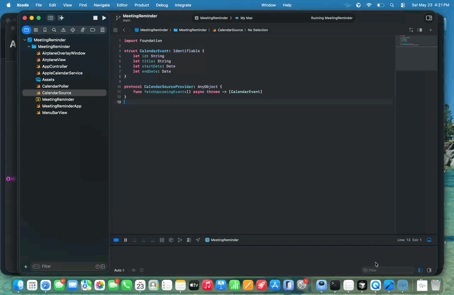

<div align="center">


# Quiet Reminder

**A hand-drawn airplane flies across your screen before every meeting.**

A native macOS menu bar app that sends a hand-drawn airplane trailing a banner across your screen five minutes before each calendar event — so you never miss a meeting. Part of the [Quiet Apps](https://github.com/quietapps) family.

[](https://www.apple.com/macos/)
[](https://swift.org)
[](https://developer.apple.com/xcode/swiftui/)
[](LICENSE)

[Features](#features) · [Usage](#usage) · [Build from source](#build-from-source) · [FAQ](#faq)

<p>
  
</p>

</div>

---

## Why

You're heads-down in code, a doc, a design — and the standup starts in three minutes. Quiet Reminder sends a hand-drawn airplane gliding across your screen, trailing a banner with the meeting title, five minutes before every event on your calendar. No notification badge to dismiss, no menu bar to check. You literally cannot miss it.

Works with any calendar you've connected to Calendar.app — iCloud, Google, Exchange, or all three at once.

## Features

- **Flying banner** — borderless transparent panel above every window, including fullscreen apps; banner shows meeting title and attendee names on two lines
- **Reads all your calendars** — EventKit reads directly from Calendar.app; any account (iCloud, Google, Exchange) connected there is automatically included
- **Per-calendar filter** — toggle individual calendars on or off in Preferences; changes take effect immediately, no restart needed
- **Configurable lead time** — alert 0, 2, 5, 10, or 15 minutes before each event; "On time" shows a "NOW" banner at the moment the meeting starts
- **Early warning** — optional second flyover at a higher threshold (10–30 min) before the main alert
- **Multi-screen** — one airplane panel per connected display; all monitors get the alert simultaneously
- **Snooze** — click the airplane mid-flight to snooze; re-alerts after a configurable duration (2, 5, or 10 minutes)
- **Skip solo events** — optionally suppress alerts for events with no other attendees (personal blocks, reminders)
- **Meeting join links** — detects Teams, Zoom, Google Meet, Webex, and more; decodes Microsoft SafeLinks and Mimecast protection wrappers automatically
- **Airplane themes** — five color presets (Classic, Sky, Forest, Sunset, Lavender) applied via hue rotation; no extra artwork needed
- **Configurable screen position** — slider controls vertical position of the airplane strip (top to bottom)
- **Speed picker** — Slow / Normal / Fast flight duration
- **Sound** — plays system Ping sound on each alert; toggleable
- **Launch at login** — registers with `SMAppService`; toggle in Preferences
- **Test mode** — trigger the animation on demand from the menu bar
- **Menu bar agent** — no Dock icon, no app switcher entry

## Usage

| Action | How |
|---|---|
| Grant calendar access | Click ✈️ → **Grant Calendar access** → Allow |
| Open Preferences | Click ✈️ → **Preferences…** |
| Change alert lead time | Preferences → Alerts tab |
| Filter calendars | Preferences → Calendars tab |
| Change theme or position | Preferences → Display tab |
| Snooze an alert | Click the airplane mid-flight |
| Test the animation | Click ✈️ → **Test airplane** |
| Quit | Click ✈️ → **Quit** |

The airplane appears automatically before each upcoming event. No further interaction needed once Calendar access is granted.

## Permissions

Quiet Reminder needs **Calendar** access to read upcoming events.

On first launch click **Grant Calendar access** in the menu — macOS shows its standard privacy prompt. The app polls every 60 seconds and starts alerting as soon as access is granted, no restart required.

## Adding your Google Calendar

Quiet Reminder reads from Calendar.app via Apple's EventKit framework. No separate Google integration needed:

1. **System Settings → Internet Accounts → Add Account → Google**
2. Sign in and allow access; make sure **Calendars** is toggled on
3. Open **Calendar.app** and confirm your Google events appear
4. Click **Test airplane** in the Quiet Reminder menu to confirm

No API keys, no OAuth client setup, no developer console.

## Build from source

### Requirements

- macOS 26.0 or later
- Xcode 26.0 or later
- Calendar.app with at least one calendar configured

No paid Apple Developer account required — the project uses ad-hoc signing (`Sign to Run Locally`).

### Steps

```bash
git clone https://github.com/quietapps/QuietReminder.git
cd QuietReminder
open QuietReminder.xcodeproj
```

Press **⌘R** in Xcode. The ✈️ appears in your menu bar.

Or from the command line:

```bash
xcodebuild -project QuietReminder.xcodeproj -scheme QuietReminder -configuration Release build
```

### Project layout

```
QuietReminder/
├── QuietReminderApp.swift       # @main + MenuBarExtra
├── AppController.swift          # Coordinator: EventKit + poller + overlay
├── MenuBarView.swift            # Status / Grant access / Speed / Test / Quit
├── CalendarSource.swift         # CalendarEvent + provider protocol
├── AppleCalendarService.swift   # EventKit implementation
├── CalendarPoller.swift         # 60s timer, fires onMeetingSoon
├── AirplaneView.swift           # SwiftUI airplane + banner animation
├── AirplaneOverlayWindow.swift  # Transparent NSPanel above everything
├── QuietReminder.entitlements   # Sandbox disabled
└── Assets.xcassets/             # Airplane, banner, app icon, menu bar icon
```

No external dependencies — Apple frameworks only (SwiftUI, AppKit, EventKit).

## Configuration

All settings are in **Preferences** (✈️ → Preferences…). Reset to defaults:

```bash
defaults delete app.quiet.QuietReminder
```

## FAQ

**Does it work with Google Calendar?**
Yes — connect Google to Calendar.app via System Settings → Internet Accounts. Quiet Reminder picks it up via EventKit automatically. No API keys or OAuth setup.

**My Teams meeting link isn't showing.**
The app decodes Microsoft SafeLinks and Mimecast-wrapped URLs automatically. If the link still doesn't appear, check that the calendar event has a URL or notes field containing the join link.

**The airplane doesn't appear before my meeting.**
Check that Calendar access is granted (green indicator in ✈️ menu). Use **Test airplane** to confirm animation works. Check Preferences → Calendars to make sure the relevant calendar is not filtered out.

**Can I use it with multiple calendars?**
Yes — EventKit reads every calendar in Calendar.app. Toggle individual calendars in Preferences → Calendars.

**How do I snooze?**
Click the airplane while it's flying. It re-alerts after the snooze duration configured in Preferences → Alerts.

**How do I quit?**
Click ✈️ → **Quit**.

## License

[MIT](LICENSE) © Quiet Apps

---

<div align="center">
If Quiet Reminder keeps you on time, drop a ⭐ on the repo.
</div>
